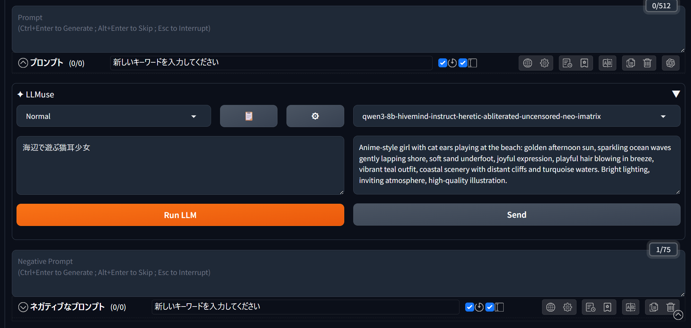

# sd-webui-llmuse

LM Studio のローカル LLM を使って、日本語入力から英語プロンプトを生成する Forge Neo 拡張機能です



## 機能

- 日本語を入力するだけで英語プロンプトを生成
- Simple / Normal / Detail の 3 段階プリセットで生成の詳細度を調整
- プリセットのシステムプロンプトを自由に編集・追加・削除可能
- 使用するモデルをドロップダウンで切り替え
- 生成結果を Forge Neo のプロンプト欄へ自動送信
- Run LLM → 画像生成を繰り返す連続生成モード

## インストール方法

**LM Studio のセットアップ**

1. [https://lmstudio.ai/](https://lmstudio.ai/) からインストーラーをダウンロードしてインストール
2. **Discover** タブでモデルを検索し、**Instruct** モデルをダウンロード


   ※ 必ず Instruct モデルを使用してください。Base モデルではシステムプロンプトに従いません。開発・検証は 16GB VRAM 環境で `Qwen3-8B-Instruct (Q4_K_M)` を使用しています。

   | VRAM | 推奨モデル | サイズ (Q4_K_M) |
   |------|-----------|----------------|
   | 24GB〜 | `Qwen3-14B-Instruct (Q4_K_M)` | 〜9.3GB |
   | 16GB | `Qwen3-8B-Instruct (Q4_K_M)` ← 開発環境 | 〜5.2GB |
   | 12GB | `Qwen3-4B-Instruct (Q4_K_M)` | 〜2.6GB |

   モデルサイズは量子化（Q値）によって変わります。Q値が高いほど精度が高くサイズも大きくなり、低いほど軽量になります。`Q4_K_M` は精度と軽量さのバランスが良くおすすめです。

   ※ SD モデルと VRAM を共有するため、実際に使える容量は環境によって異なります。上記はあくまで目安です。NSFW 用途の場合は検索キーワードに `Heretic` や `abliterated` を加えると良い感じのモデルが見つかります。

3. **Developer** タブで **Start Server** をクリックしてサーバーを起動

**LLMuse のインストール**

1. WebUI を起動
2. **Extensions** タブ → **Install from URL** を開く
3. 以下のURLを貼り付けて Install をクリック：
   ```
   https://github.com/ranran141/sd-webui-llmuse
   ```
4. WebUI を再起動

## 動作環境

- Forge Neo

## 使い方

txt2img タブのプロンプト欄の下に **「✦ LLMuse」** アコーディオンが表示されます。

1. ドロップダウンから**プリセットを選択**（Simple / Normal / Detail）
   - **Simple** — 入力を忠実に翻訳するだけ、追加要素なし
   - **Normal** — 翻訳 + 照明・雰囲気・画質タグを自然に補完（60〜80 語程度）
   - **Detail** — キャラクター詳細・ポーズ・背景・画風まで全展開（100 語以上）
2. 左のテキストボックスに**日本語で入力**
3. **Run LLM** をクリック → 右側に生成された英語プロンプトが表示される
4. モデル右の **Add / Rep** でプロンプト欄への送信モードを切り替え
   - **Add** — 既存のプロンプトに追記
   - **Rep** — 既存のプロンプトを上書き
5. **Send** をクリックして Forge Neo のプロンプト欄へ送信

### 設定（⚙ ボタン）

| 項目 | 説明 |
|------|------|
| LM Studio URL | サーバーアドレス（デフォルト: `http://localhost:1234`） |
| Randomness | 出力のランダム性。低いほど忠実、高いほど多様（0.1〜2.0） |
| Auto-send | 生成後に自動でプロンプト欄へ送信する |
| Auto-generate | プロンプト欄へ送信後、自動で画像生成を開始する |
| Continuous | Run LLM → プロンプト送信 → 画像生成を繰り返す |
| Loop delay | Continuous 有効時に、次の Run LLM を実行するまでの待機時間 |
| Auto-unload | 使用後 n 秒でモデルを VRAM から解放する |
| Timeout | n 秒以内に応答がなければ中断する |
| Force Unload | 全モデルを今すぐ VRAM から解放する |

Continuous を有効にすると、`Run LLM → プロンプト欄へ送信 → 画像生成 → Run LLM` の流れを自動で繰り返します。
なお、Continuous 有効時は、プロンプトの意図しない累積を防ぐため、Add / Rep の選択に関わらず上書き送信します。
連続生成を停止する場合は、**Run LLM** ボタンを右クリックします。現在の画像生成が完了した後、次の Run LLM 実行を停止します。

### プリセットエディタ（📋 ボタン）

- ドロップダウンからプリセットを選択して読み込む
- テキストエリアでシステムプロンプトを編集
- **＋** ボタンで新規プリセットを作成
- **ゴミ箱アイコン**でプリセットを削除（最後の 1 件は削除不可）
- **💾 Save** で保存

## 更新履歴

### v1.2.0

- 連続生成モードを追加。LLM生成 → 画像生成を自動でループさせることが可能に（contributed by @ryuhaku）

### v1.1.0

- モデル選択欄の右に **Add / Rep** トグルを追加

### v1.0.0

- 初回リリース
